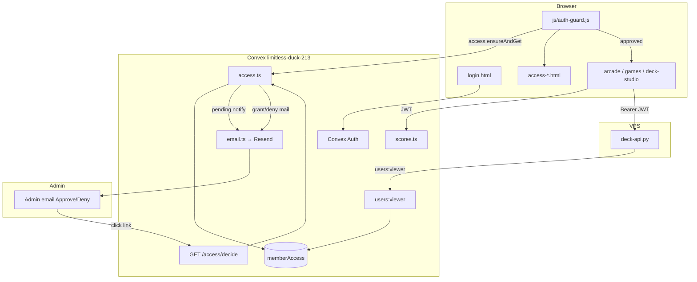

# Architecture

## High-level diagram



Membership is **orthogonal** to auth identity: a user can be fully signed in (JWT valid) and still be blocked until `memberAccess.status === "approved"`.

---

## Components

### Convex backend

- **`convex/access.ts`**
  - `ensureAndGet` (mutation) — ensure a `memberAccess` row exists; create pending + notify admin; auto-approve admin email.
  - `requestAgain` (mutation) — after first deny only; back to `pending` + new token + notify.
  - `notifyAdminPending` (internalMutation) — email admin with decide links.
  - `applyDecision` (internalMutation) — approve / deny / unauthorized + user emails.
  - `decideHttp` (httpAction) — HTML response for admin clicking links.
- **`convex/http.ts`** — registers auth routes + `GET /access/decide` → `decideHttp`.
- **`convex/email.ts`** — `internal.email.send` → Resend HTTP API (`AUTH_RESEND_KEY`).
- **`convex/users.ts`** — `viewer` query returns `accessStatus` / `denyCount` (no auto-create).
- **`convex/scores.ts`** — `requireApprovedUser` / `requireApprovedUserId`; non-approved get errors / empty / null.

### Static client

- **`js/auth-guard.js`** — after `ArcadeAuth.init()`, calls `access:ensureAndGet`, redirects by status.
- **Access pages** — messaging + poll / request-again / permanent block.
- **`js/convex-config.js`** — `STIJN_ARCADE_CONVEX_URL = "https://limitless-duck-213.convex.cloud"`.

### Deck worker (VPS)

- **`deploy/cursor-worker/deck-api.py`**
  - `_auth()`: Bearer token → Convex `users:viewer` query.
  - Rejects unless `viewer.accessStatus == "approved"` (same gate as the browser).
  - Default `CONVEX_URL` matches duck; override via env on the server if needed.
  - Lives under `/opt/cursor-worker`; **not** published by static-site rsync (`deploy/` excluded).

---

## Data model (`memberAccess`)

Defined in `convex/schema.ts`:

| Field | Type | Notes |
|-------|------|--------|
| `userId` | `Id<"users">` | Convex Auth user; index `by_user` |
| `email` | `string` | Lowercased on write |
| `name` | optional `string` | From auth profile |
| `status` | `"pending" \| "approved" \| "denied" \| "unauthorized"` | Gate value |
| `denyCount` | `number` | Incremented on each deny; `>= 2` → unauthorized |
| `decisionToken` | `string` | Opaque hex token for Approve/Deny links; rotated after each decision |
| `requestedAt` | `number` | ms epoch |
| `decidedAt` | optional `number` | Set on approve/deny |

Indexes: `by_user`, `by_token` (`decisionToken`), `by_email`.

One row per user (looked up with `.unique()` on `by_user`). Tokens are 24 random bytes → 48 hex chars (`newToken()` in `access.ts`).

---

## Client gate

`js/auth-guard.js` runs on protected pages:

1. No `ArcadeAuth` / not authenticated → `login.html?next=<page>`.
2. Call `access:ensureAndGet` (creates pending on first visit).
3. Redirect:
   - `approved` → stay (if on an access page → `arcade.html`)
   - `pending` → `access-pending.html`
   - `denied` → `access-denied.html`
   - `unauthorized` → `access-blocked.html`
   - unknown → treat as pending

**`access-pending.html`** polls `ensureAndGet` every 8s so approval lands without a hard refresh.

**`access-denied.html`** calls `access:requestAgain` on button click.

**`access-blocked.html`** is terminal (sign out / back home only).

---

## Server enforcement

| Surface | Check |
|---------|--------|
| Browser UI | `auth-guard.js` (UX only — can be bypassed by a crafted client) |
| Score APIs | `scores.ts` requires `memberAccess.status === "approved"` |
| Deck API | `deck-api.py` `_auth()` requires `accessStatus == "approved"` via `users:viewer` |
| Approve/Deny | Only valid `decisionToken` while status is `pending` (idempotent if already approved/unauthorized) |

Always enforce on the server; the HTML gate is for UX.

---

## Emails (Resend)

All sends go through `convex/email.ts` → `https://api.resend.com/emails`.

| Trigger | To | Subject (approx.) | Contents |
|---------|-----|-------------------|----------|
| New / re-request pending | `ADMIN_EMAIL` | `[PragmatICT] Access request — {email}` | User identity + Approve + Deny links |
| Approve | requester | `My Pragmatict access granted` | Link to `{SITE_URL}/login.html?next=arcade.html` |
| First deny | requester | `My Pragmatict access denied` | May request once more + login link |
| Second deny | requester | `My Pragmatict access denied` | Permanent; no further requests |

Admin decide links (not relative to pragmatict.be):

```
{CONVEX_SITE_URL}/access/decide?token=…&decision=approve
{CONVEX_SITE_URL}/access/decide?token=…&decision=deny
```

`CONVEX_SITE_URL` is **built-in** on the deployment (e.g. `https://limitless-duck-213.convex.site`). Do **not** set it with `npx convex env set` (`EnvVarNameForbidden`).

If `ADMIN_EMAIL` is unset, pending rows are still created but **no admin email** is sent (`notifyAdminPending` logs and returns).

---

## Environment variables

Set on the **live** Convex deployment (`limitless-duck-213`) unless noted.

| Variable | Where | Purpose |
|----------|--------|---------|
| `ADMIN_EMAIL` | Convex | Auto-approve match; recipient of Approve/Deny mail |
| `SITE_URL` | Convex | Links in user emails; HTML “Back to PragmatICT” on decide pages. Local: `http://localhost:8080`. Prod: `https://pragmatict.be` |
| `AUTH_RESEND_KEY` | Convex | Resend API key (auth codes **and** access emails) |
| `AUTH_EMAIL_FROM` | Convex (optional) | From address; default `PragmatICT <onboarding@resend.dev>` |
| `CONVEX_SITE_URL` | Convex **built-in** | Base for `/access/decide` and auth; do not CLI-set |
| `JWT_PRIVATE_KEY` / `JWKS` | Convex | Auth (see AUTH.md) |
| `AUTH_GOOGLE_ID` / `AUTH_GOOGLE_SECRET` | Convex | Google OAuth |
| `CONVEX_URL` | VPS deck-api env (optional) | Defaults to duck `.convex.cloud` |

Also client-side (not a secret): `js/convex-config.js` → `STIJN_ARCADE_CONVEX_URL`.
