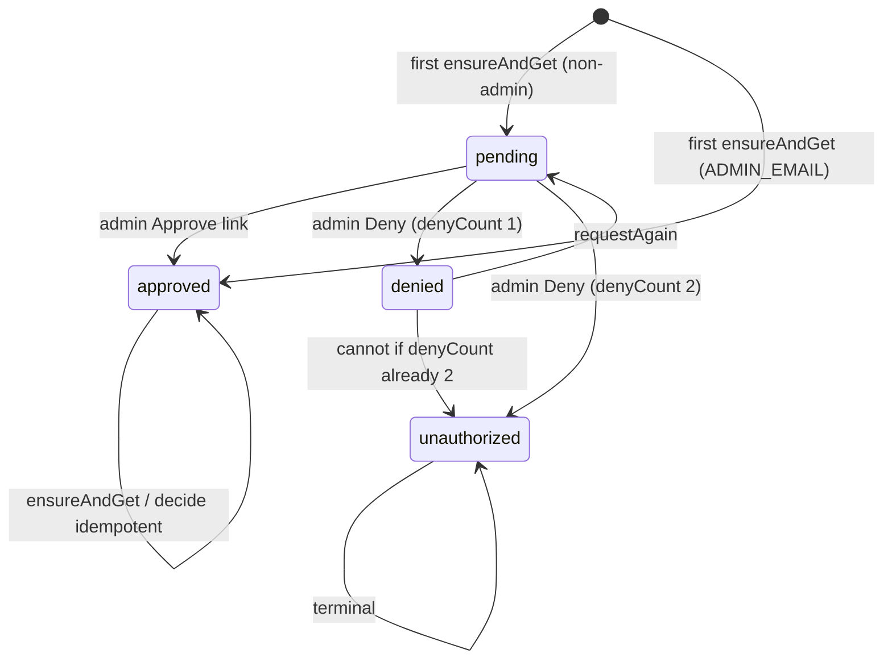

# End-to-end flows

All membership mutations require a signed-in Convex Auth user (`getAuthUserId`). Emails are compared lowercased.

---

## Flow overview

---

## 1. First visit / request (non-admin)

1. User signs in on `login.html`, lands on a protected page (e.g. `arcade.html`).
2. `auth-guard.js` calls mutation **`access:ensureAndGet`**.
3. No `memberAccess` row yet → insert:
   - `status: "pending"`
   - `denyCount: 0`
   - fresh `decisionToken`
   - `requestedAt: now`
4. Schedule **`notifyAdminPending`** → email to `ADMIN_EMAIL` with Approve / Deny links (attempt labelled “first request”).
5. Client redirects to **`access-pending.html`** (polls every 8s).

If `ADMIN_EMAIL` is missing: row is still `pending`, but admin is **not** emailed (check Convex logs).

---

## 2. Admin approves

1. Admin opens  
   `GET https://limitless-duck-213.convex.site/access/decide?token=…&decision=approve`  
   (routed in `convex/http.ts` → `decideHttp`).
2. **`applyDecision`**:
   - Lookup by `by_token`.
   - If already `approved` / `unauthorized` → idempotent success page.
   - If not `pending` → 409 “Already decided”.
   - Else patch `status: "approved"`, `decidedAt`, **rotate** `decisionToken`.
   - Email user: access granted + login link (`SITE_URL`).
3. Admin sees HTML confirmation page.
4. User’s pending page poll (or next visit) sees `approved` → `arcade.html`.

---

## 3. First deny → request again

1. Admin clicks Deny on a `pending` row with `denyCount === 0`.
2. **`applyDecision`**:
   - `denyCount` → `1`
   - `status: "denied"`
   - rotate token; set `decidedAt`
   - Email user: denied, may request once more.
3. Pending poll / next guard → **`access-denied.html`**.
4. User clicks **Request access again** → **`access:requestAgain`**:
   - Allowed only if `status === "denied"` and `denyCount < 2`.
   - Patch back to `pending`, new token, update `requestedAt` / name / email.
   - Notify admin again (“second request (final)”).
5. Redirect to **`access-pending.html`**.

Old Approve/Deny links stop working after token rotation (404 / not pending).

---

## 4. Second deny → unauthorized

1. Admin denies while `pending` and `denyCount === 1`.
2. **`applyDecision`**:
   - `denyCount` → `2`
   - `status: "unauthorized"`
   - rotate token
   - Email user: second denial; access not authorised.
3. Client → **`access-blocked.html`**.
4. Further **`requestAgain`** throws `"Access permanently denied"`.

There is no self-service unlock; fix in Convex dashboard (edit/delete row) or a future admin tool if you add one.

---

## 5. Admin bootstrap (auto-approve)

On **`ensureAndGet`**:

- If signed-in email equals `ADMIN_EMAIL` (trimmed, lowercased):
  - **No row** → insert directly as `approved` (no admin notify email).
  - **Existing non-approved row** → force-patch to `approved` (avoids lockout if the row existed before `ADMIN_EMAIL` was set).

Admin never depends on clicking their own Approve link.

---

## 6. Decision HTTP details

| Result | HTTP | Page title |
|--------|------|------------|
| Missing/bad `token` or `decision` | 400 | Invalid link |
| Unknown token | 404 | Unknown request |
| Not pending (e.g. already `denied`) | 409 | Already decided |
| Approved | 200 | Approved |
| First deny | 200 | Denied |
| Second deny | 200 | Unauthorised |

Method is **GET** so mailto / email clients can open links without a POST form. Tokens are single-use in practice (rotated on decision). Treat inbox links as secrets.

---

## 7. Scores and Deck while gated

- **Scores**: unauthenticated or non-approved callers fail mutations (`Not authorised`) or get empty/null from queries.
- **Deck API**: missing/invalid Bearer or `accessStatus != "approved"` → `401 {"error":"unauthorized"}`.

Signing in alone is not enough; membership must be approved.
